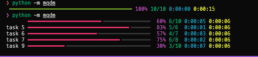

# mqdm: progress bars for multiprocessing
Pretty progress bars using `rich`, in your child processes.

## Install

```bash
pip install mqdm
```

## Normal tqdm-style progress bars
```python
import mqdm

items = range(10)

# nested loop progress
for x in mqdm.mqdm(items):
    # your description can change for each item
    for y in mqdm.mqdm(items, desc=lambda y, i: f'item {x} {y}'):
        print(x, y)
```


## Progress of work across worker pools
```python
import mqdm
import time

def my_work(n, sleep):
    for i in mqdm.mqdm(range(n), description=f'counting to {n}'):
        time.sleep(sleep)

# executes my task in a concurrent futures process pool
mqdm.pool(
    my_work,
    range(1, 10),
    sleep=1,
    n_workers=3,
)
```



## Pandas
```python
import mqdm

df = pd.read_csv('...')

# iterrows is a generator - use total to set the iterator length
for i, x in mqdm.mqdm(df.iterrows(), total=len(df)):
    for j in mqdm.mqdm(range(x['N']), disable=x['N'] < 10):  # you can disable the progress bar for quick loops
        ...
```

## Debug utilities
These are common utilities I use when debugging scripts that require progress bars/multiprocessing.

Open an interactive ipdb shell on exception (like `@ipdb.iex`). This wrapper will make sure that the progress bar does not interfere with the traceback and interactive prompt.
```python
@mqdm.iex
def main():
    ...
```

Profiles the function and prints the results upon exiting.
```python
@mqdm.profile
def main():
    ...
```

Add a breakpoint without interfering with the progress bar.
```python
def main():
    for i in mqdm.mqdm(range(10)):
        mqdm.bp()
```

Open a IPython shell in the current context without interfering with the progress bar.
```python
def main():
    for i in mqdm.mqdm(range(10)):
        mqdm.embed()
```
