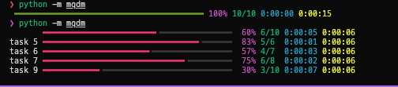

# mqdm

<div class="hero">
  <div class="hero-copy">
    <h1>progress bars for parallel work</h1>

  </div>
  <div class="hero-art">
    
  </div>
</div>

`mqdm` keeps the familiar `tqdm`-style loop shape while adding support for parallel workers and nested progress bars. 
`mqdm` works seamlessly across processes allowing you to transparently track progress without worrying about the underlying parallelism.

In the spirit of tqdm (taqadum, تقدّم), mqdm stands for "mutaqaddim" (مُتَقَدِّم) which means "the one who progresses" referring to the parallel workers that are advancing the progress. 
The less ret-con-y name is "multiprocessing tqdm" :)

<div id="cast-home-main" class="asciinema-player mqdm-cast" data-cast-src="assets/casts/home/main.cast" data-cols="80"></div>

## The basic shape

`mqdm` wraps an iterable, just like `tqdm`.

```python
--8<-- "snippets/home/basic_shape.py"
```

<div id="cast-home-basic" class="asciinema-player mqdm-cast" data-cast-src="assets/casts/home/basic_shape.cast"></div>

The same shape also seamlessly scales to parallel work:

```python
--8<-- "snippets/home/why_mqdm.py"
```

<div id="cast-home-why" class="asciinema-player mqdm-cast" data-cast-src="assets/casts/home/why_mqdm.cast"></div>

## Why mqdm?

`mqdm` gives you:

- [`tqdm`](https://tqdm.github.io/)-style progress bars
- automatic nested progress bars across parallel workers
- worker-pool execution with [`concurrent.futures`](https://docs.python.org/3/library/concurrent.futures.html) (processes and threads)
- pretty progress bars and TUI integration, powered by [`rich`](https://rich.readthedocs.io/en/stable/introduction.html)
- progress-safe printing and logging across processes

## Get Started

For an end-to-end example, start with [Examples](examples/index.md). 

For examples for how to use mqdm, see:

1. [Loops](examples/loops.md)
2. [Pools](examples/pools.md)
3. [Output](examples/output.md)
4. [Patterns](examples/patterns.md)

For the full API, see [API reference](api/index.md). 
